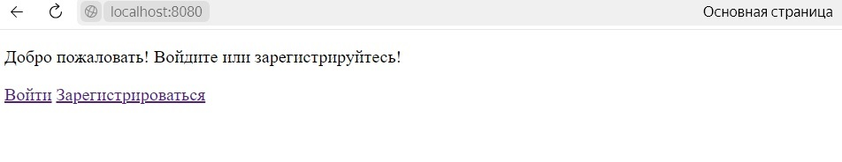
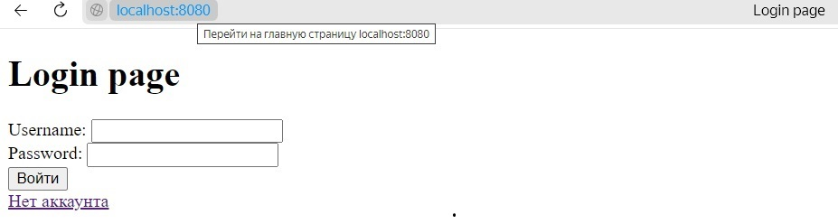
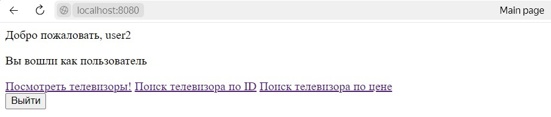
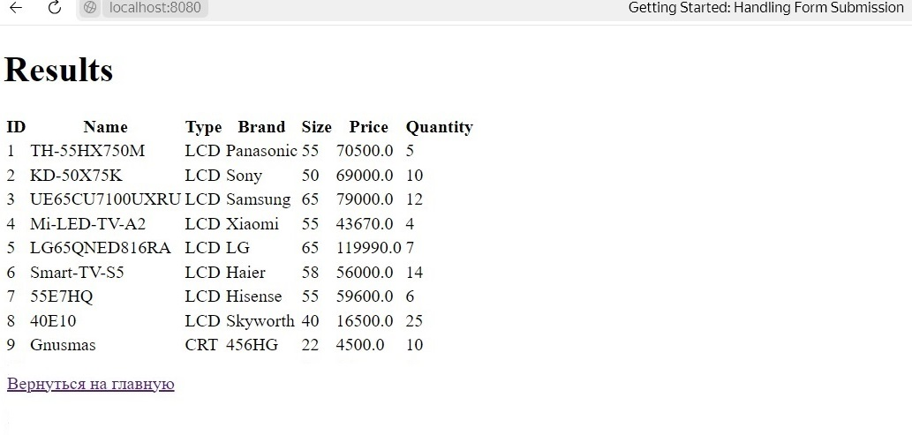
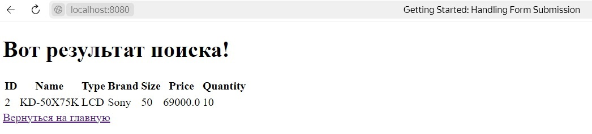
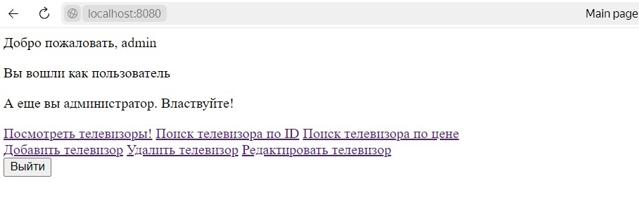
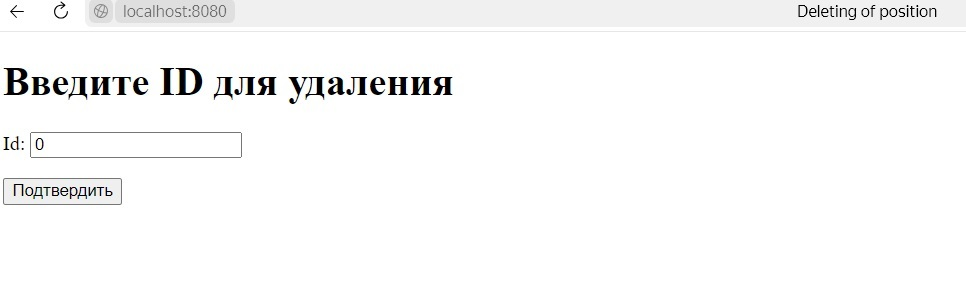
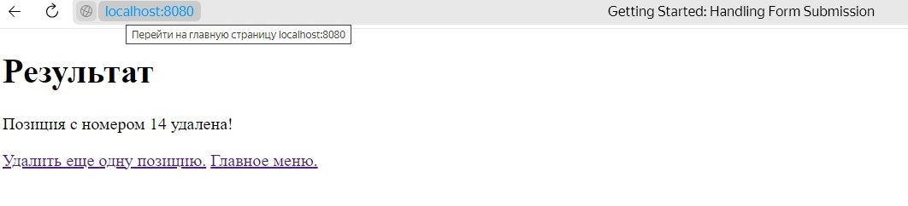
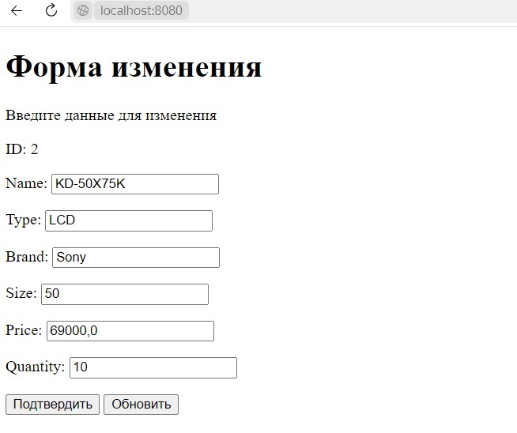

# Практическая работа №6. Spring Security

## Цель работы

Ознакомиться с настройкой безопасности в Spring.

## Задачи

Изменить практическую работу №5, добавив следующий функционал:

1. Добавить простейшую страницу регистрации. Пользователь вводит свои логин и пароль и данная информация вносится в базу данных, пользователю присваивается роль пользователя (User) приложения.
2. Добавить простейшую форму аутентификации. Форма создается программно, а не автоматически генерируется Spring.
3. В приложении должен быть предусмотрен пользователь — администратор (Admin) с ролью отличной, от User.
4. Разграничить уровни доступа к страницам приложения. Пользователь (User) имеет доступ только к страницам просмотра всех записей и запросов. Администратор (Admin) имеет возможность добавлять, редактировать и удалять записи.
5. Информация о пользователях и их ролях должна храниться в базе данных. Способ хранения — на усмотрение студента.
6. Предусмотреть возможность выхода из приложения (logout).
7. Продемонстрировать умение настраивать безопасность на уровне представлений. Для этого реализуется приветствие пользователя после его входа и отображение элемента на основе его роли.

### Вариант №1

Телевизор

## Инструкция по установке и настройке PostgreSQL

### 1. Установите PostgreSQL:

Убедитесь, что на Вашем компьютере установлен [PostgreSQL](https://www.postgresql.org/download/).

### 2. Создайте базу данных и пользователя:

Откройте SQL Shell и введите следующие команды для создания базы данных и пользователя:

```
CREATE DATABASE postgres WITH ENCODING 'UTF8';
```

Также, необходимо создать пользователя postgres с правами, позволяющими использовать базу данных:

```
CREATE USER postgres WITH ENCRYPTED PASSWORD 'qwerty';
GRANT ALL PRIVILEGES ON DATABASE postgres TO postgres; 
```

### 3. Инициализация баз данных:

1. Запустите скрипт ```init.sql``` с помощью следующей команды:

```
psql -U postgres -d postgres -f init.sql
```

2.  Запустите скрипт ```init_role_users.sql``` с помощью следующей команды:
  
```
psql -U postgres -d postgres -f init_role_users.sql
```

3. Запустите скрипт ```add_admin_role.sql``` с помощью следующей команды:
  
```
psql -U postgres -d postgres -f add_admin_role.sql
```
4. Запустите скрипт ```insert_roles.sql``` с помощью следующей команды:
  
```
psql -U postgres -d postgres -f insert_roles.sql
```

## Инструкция по сборке и запуску Java-проекта из командной строки

### 1. Установите JDK и Maven:

Убедитесь, что на Вашем компьютере
установлены [JDK](https://www.oracle.com/java/technologies/downloads/)
и [Maven — фреймворк для автоматизации сборки проектов](https://maven.apache.org/). Вы можете проверить это,
выполнив в командной строке следующую команду:

```
java -version
mvn -version
```

### 2. Компиляция и запуск:

Откройте терминал и перейдите в директорию вашего проекта, затем выполните следующие команды:

```
mvnw clean package
java -jar target/lab6-0.0.1-SNAPSHOT.jar
```

### 3. Запуск WEB приложения

Откройте ваш браузер и введите в адресную строку:

```
http://localhost:8080/
```

# Примеры работы с приложением


## 1. Стартовая страница

 



## 2. Страница ввода пользователя или администратора




Если аккаунт не существует нажмите "Нет аккаунта" и создайте пользователя с любым именем и паролем. 

Если нужно роль администратора для возможности редактирования базы данных телевизоров создайте администратора, для этого в поле "Username" введите имя "admin"

в поле "Password" введите любой пароль


## 3. Результат входа с ролью "пользователь"





## 4. Результат вывода списка телевизоров из базы данных с ролью "пользователь"





## 5. Результат поиска телевизоров цена которых ниже определенной с ролью "пользователь"





## 6. Результат входа с ролью "администратор"


  


## 7. Форма удаления телевизора из базы данных с ролью "администратор"


  


## 8. Результат удаления телевизора из базы данных с ролью "администратор"


  


## 9. Форма изменения телевизора из базы данных с ролью "администратор"


  


    


   

   
